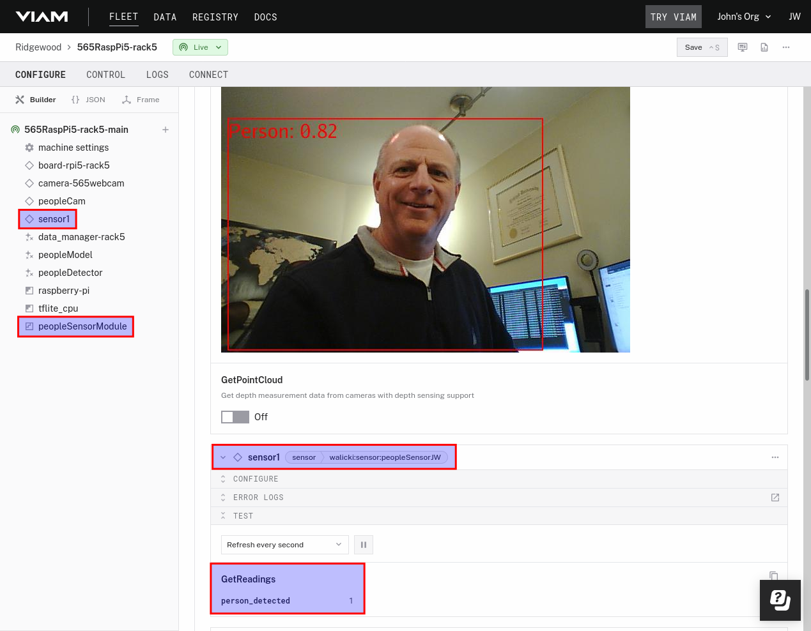
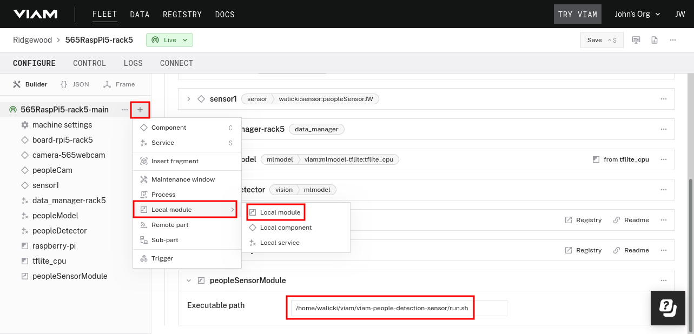
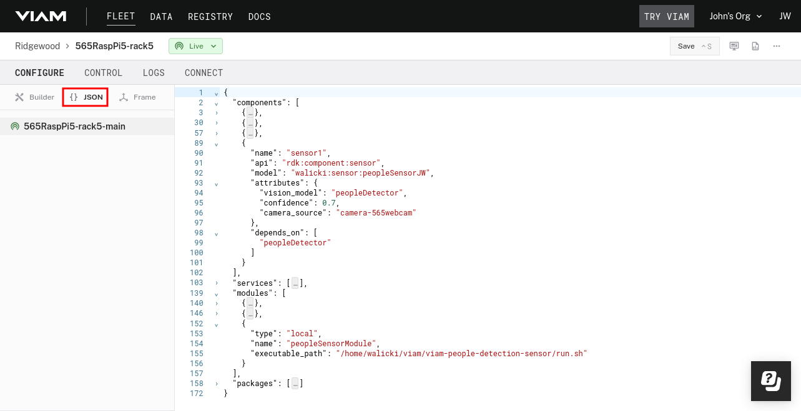
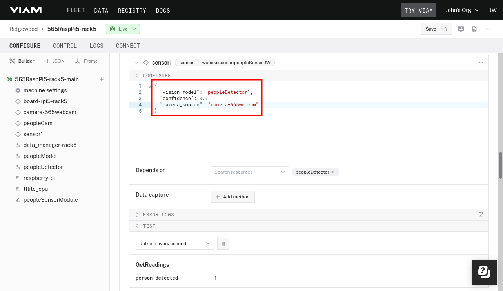

# VIAM People Detection Sensor / Local Module Example

This VIAM People Detection Sensor example demonstrates how to create a custom modular resource using Viam's Python SDK, and how to connect it to a webcam / People detection vision model in the Viam App dashboard.

To review this VIAM People Detection Sensor example implementation using Viam's TypeScript SDK / node, see this [README](node/README.md)

<center>

</center>

## Purpose

Modular resources allow you to define custom components and services, and add them to your robot. Viam ships with many component types, but you can create a custom sensor using modules. This example is a modification of the [Viam Simple Module Example](https://github.com/viamrobotics/viam-python-sdk/tree/main/examples/simple_module).

Additional Viam examples:

* Use GitHub CI to upload to the Viam Registry, take a look at [python-example-module](https://github.com/viam-labs/python-example-module).
* Use Docker to manage Python dependencies, take a look at [python-container-module](https://github.com/viamrobotics/python-container-module).

## Project structure

`git clone` this repo to your registered Viam machine.  In my case, a Raspberry Pi 5.

```bash
~/viam/viam-people-detection-sensor $ ls -tR
.:
  client.py
  README.md
  requirements.txt
  run.sh
  LICENSE
  src

./src:
  main.py
```

### run.sh

The `run.sh` script handles installation of Python dependencies from the provided `requirements.txt` and is the entrypoint for the module. It executes the `src/main.py` file. When called by the viam-agent service, the program installs and starts the module.

### main.py

The `main.py` file contains the definition of a new sensor model and code to register it. The `main.py` registers the module using a uniquely namespaced colon-delimited-triplet in the form `namespace:family:name`, and is named according to the Viam API that your model implements. A model with the `viam` namespace is always Viam-provided. In this case, the model triplet name is `walicki:sensor:peopleSensorJW`.  Read more about making custom namespaces [here](https://docs.viam.com/operate/reference/naming-modules/#create-a-namespace-for-your-organization).  This triplet name will be used in the Viam App to configure the sensor component.

```python
class peopleSensorJW(Sensor):
    MODEL: ClassVar[Model] = Model(ModelFamily("walicki", "sensor"), "peopleSensorJW")
```

The primary function of `main.py` is to implement the `get_readings()` function. It determines if the camera
and vision model has detected a **person** class at the minimum confidence score using the Object Detection COCO-SSD TensorFlow model.

```python
        detections = await self.vision_service.get_detections_from_camera(self.camera_source)
        isPerson = 0
        for d in detections:
            if d.confidence > self.confidence and d.class_name.lower() == "person":
                isPerson = 1

        return {"person_detected": isPerson}
```

`main.py` also contains `validate_config()` and `reconfigure()` functions. The validator function can raise errors that are triggered because of the configuration. It also returns a sequence of strings representing the implicit dependencies of the resource. The reconfiguration function reconfigures the resource based on the new configuration passed in.

### client.py

Outside the `src` directory, there is a `client.py` file. You can use this file to test the module once you have connected to your robot and configured the module. You will have to update the credentials and robot address by exporting VIAM_API_KEY, VIAM_API_KEY_ID and VIAM_ADDRESS before running the `client.py` program.

## Configuring and using the module

These steps assume that you have a robot available at [app.viam.com](https://app.viam.com).

The `run.sh` script is the entrypoint for this module. To connect this module with your robot, you must add this module's entrypoint to the robot's config. For example, the entrypoint file may be at `/home/user/viam/viam-people-detection-sensor/run.sh` and you must add this file path to your configuration. See the [documentation](https://docs.viam.com/operate/get-started/other-hardware/#upload-your-module) for more details.

```json
...
  "modules": [
    ...
    {
      "type": "local",
      "name": "peopleSensorModule",
      "executable_path": "/home/walicki/viam/viam-people-detection-sensor/run.sh"
    }
  ],
...  
```



## Adding and configuring a new sensor component

Once the module has been added to your robot, add a new component that uses the `peopleSensorModule` model. Copy / modify the following json into the robot's configuration via the **{} JSON** button next to **Builder**. See the [documentation](https://docs.viam.com/operate/get-started/other-hardware/#add-your-new-modular-resource-to-your-machines) for more details.



An example configuration for a Sensor component could look like this:

```json
{
    "components": [
    {
      "name": "sensor1",
      "api": "rdk:component:sensor",
      "model": "walicki:sensor:peopleSensorJW",
      "attributes": {
        "vision_model": "peopleDetector",
        "confidence": 0.7,
        "camera_source": "camera-565webcam"
      },
      "depends_on": [
        "peopleDetector"
      ]
    }
  ],
  "modules": [
       {
      "type": "local",
      "name": "peopleSensorModule",
      "executable_path": "/home/walicki/viam/viam-people-detection-sensor/run.sh"
    }
  ]
}
```

### Attributes

This example has three attributes fields that get passed to the local module. These can be used to customize which vision model and camera is selected and modify the confidence score of the people detector transform.

The sensor reports the returned status from the `main.py` function `get_readings()` in the TEST **GetReadings** field of the Viam app.



## Testing your custom sensor module

After the robot has started and connected to the module, you can use the provided `client.py` to connect to your robot and make calls to your custom, modular resources.

```bash
$ export VIAM_API_KEY=<Viam api key>
$ export VIAM_API_KEY_ID=<Viam api key id>
$ export VIAM_ADDRESS=<Viam address>
$
$ python3 ./client.py 
Resources:
[<viam.proto.common.ResourceName rdk:component:board/board-rpi5-rack5 at 0x7fff47539b70>,
 <viam.proto.common.ResourceName rdk:component:camera/camera-565webcam at 0x7fff47f00810>,
 <viam.proto.common.ResourceName rdk:service:mlmodel/peopleModel at 0x7fff47232c50>,
 <viam.proto.common.ResourceName rdk:service:vision/peopleDetector at 0x7fff48b0a070>,
 <viam.proto.common.ResourceName rdk:component:camera/peopleCam at 0x7fff47233010>,
 <viam.proto.common.ResourceName rdk:service:motion/builtin at 0x7fff47232d40>,
 <viam.proto.common.ResourceName rdk:service:data_manager/data_manager-rack5 at 0x7fff47233060>,
 <viam.proto.common.ResourceName rdk:component:sensor/sensor1 at 0x7fff47233100>]
The reading is {'person_detected': 1.0}
```

### Author

* [John Walicki](https://github.com/johnwalicki/)
